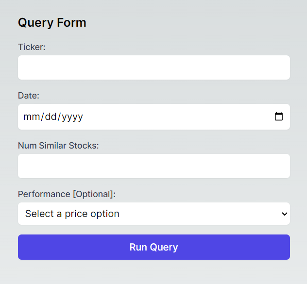

# Vector-Based Financial Similarity Analysis System

Contributors:
* Zachary Breitbart
* David Keefe
* Erich Drawdy
* Michel Maalouli
* Dylan Keskinyan

Georgia Institute of Technology

CS 4440: Emerging Database Technologies

Dr. Kexin Rong

## About

This project is an application that utilizes a vector database to analyze and identify similarities in fundamental financial data. This database leverages vector embeddings to compare stocks based on company filing financial metrics. In addition to our vector database, we use a DynamoDB database instance that allows for simple and efficient filtering and querying of stock ticker data at a given point in time, returning both a reference to its associated vector embedding and stock performance metrics. This app allows users to filter our DynamoDB database for stocks performing in a certain range, and then query against our vector database with those stocks to find correlated companies that are undervalued.  This information could potentially be used to extract value via a correlation-based investing algorithm. 

## Dataset
Fundamental stock data for the top 500 companies: https://www.dropbox.com/scl/fo/2a3vle5z26blslp2djm2s/AE_ngFSP7N638SKSP1xqm_4?rlkey=bjacxcic5j9ztde7q4y66khld&st=eij197ep&dl=0

This link has the original dataset, the Dynamo dataset, and the Pinecone dataset (including embeddings).

See \CS4440\data-gathering\data.ipynb to see how this data was gathered and cleaned.

## Database Systems and Setup Instructions
* DynamoDB (Boto3 v1.34.90): https://docs.aws.amazon.com/amazondynamodb/latest/developerguide/SettingUp.html
* Pinecone v3.2.2: https://docs.pinecone.io/guides/getting-started/quickstart

## Finished Product

Go to https://cs-4440.vercel.app/ (note, this may not be hosted after the demo)

## Embedding Generation
See \CS4440\fin-vec\embeddings for the autoencoder network. To see the tangible embeddings, see the dropbox link under "Dataset"

## Download and Run Locally

Note unless given root access to the AWS server, you will not be able to run the full app locally.

1. Clone the Git repository at https://github.com/mixh8/CS4440
2. run: _pip install requirements.txt_
3. Install node package manager: https://docs.npmjs.com/downloading-and-installing-node-js-and-npm
4. Install the dependencies found in CS4440\fin-vec\package.json using _npm install_
4. run: amplify pull --appId **_REDACTED_** --envName dev (_Contact us if you need the credentials to run this locally_)
5. run: _npm --prefix .\fin-vec\ run dev_
6. Go to the specified localhost endpoint

## Usage

Ticker: select any stock ticker from the top 500 companies.

Date: Use the date selecter component for the date you want to run the similarity search

Num Similar Stocks: Number of similar stocks that will be returned by Pinecone and charted

Performance [Optional]: 
 * Underperforming: Only returns stocks whose 7 day price % change is less than the stock specified in "Ticker" field.
 * Overperforming: Only returns stocks whose 7 day price % change is more than the stock specified in "Ticker" field.